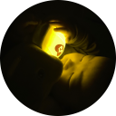

# Sit

<p align="center">
  
</p>
<p align="center">A simple image tool</p>

<p align="center">
  
</p>

## Prerequisites

### Allow screen recording on macOS

1. On your Mac, choose Apple menu  > System Preferences, click Security & Privacy, then click Privacy.

2. Select Screen Recording.

3. Select the checkbox next to an app to allow it to record your screen.
   Deselect the checkbox to turn off access for that app.

## Features

* Take screenshot
* Add rectangle to screenshot
* Add text to screenshot
* Add line to screenshot
* Store screenshot history
* Zoom In/Out by wheel or button
* Clip Image

## Development

1. Install dependencies
   
   ```sh
   yarn
   ```

2. Start local environment

   ```sh
   yarn start
   ```

3. Package

   ```sh
   yarn dist
   ```
